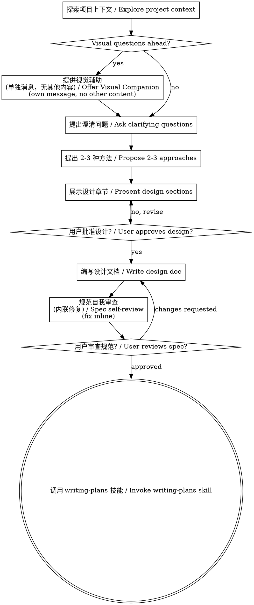

# 头脑风暴：将想法转化为设计 / Brainstorming Ideas Into Designs

通过自然协作对话帮助将想法转化为完整的设计和规范。
Help turn ideas into fully formed designs and specs through natural collaborative dialogue.

从理解当前项目上下文开始，然后一次一个问题地完善想法。一旦理解了要构建的内容，展示设计并获得用户批准。
Start by understanding the current project context, then ask questions one at a time to refine the idea. Once you understand what you're building, present the design and get user approval.

<HARD-GATE>
在展示设计并获得用户批准之前，不要调用任何实现技能、编写任何代码、搭建任何项目或采取任何实现行动。这适用于每个项目，无论其看起来多么简单。
Do NOT invoke any implementation skill, write any code, scaffold any project, or take any implementation action until you have presented a design and the user has approved it. This applies to EVERY project regardless of perceived simplicity.
</HARD-GATE>

## 反模式："这太简单了，不需要设计" / Anti-Pattern: "This Is Too Simple To Need A Design"

每个项目都要经过这个过程。待办列表、单功能工具、配置更改——所有这些。"简单"的项目是未经审查的假设导致最多浪费工作的地方。设计可以很简短（真正简单的项目只需几句话），但你必须展示它并获得批准。
Every project goes through this process. A todo list, a single-function utility, a config change — all of them. "Simple" projects are where unexamined assumptions cause the most wasted work. The design can be short (a few sentences for truly simple projects), but you MUST present it and get approval.

## 检查清单 / Checklist

你必须为以下每个项目创建任务并按顺序完成：
You MUST create a task for each of these items and complete them in order:

1. **探索项目上下文** — 检查文件、文档、最近的提交
   **Explore project context** — check files, docs, recent commits
2. **提供视觉辅助**（如果主题涉及视觉问题）— 这是单独的消息，不与其他澄清问题结合。参见下面的视觉辅助部分。
   **Offer visual companion** (if topic will involve visual questions) — this is its own message, not combined with a clarifying question. See the Visual Companion section below.
3. **提出澄清问题** — 一次一个，理解目的/约束/成功标准
   **Ask clarifying questions** — one at a time, understand purpose/constraints/success criteria
4. **提出 2-3 种方法** — 附带权衡和你的建议
   **Propose 2-3 approaches** — with trade-offs and your recommendation
5. **展示设计** — 按复杂度分节展示，每节后询问是否正确
   **Present design** — in sections scaled to their complexity, get user approval after each section
6. **编写设计文档** — 保存到 `docs/superpowers/specs/YYYY-MM-DD-<topic>-design.md` 并提交
   **Write design doc** — save to `docs/superpowers/specs/YYYY-MM-DD-<topic>-design.md` and commit
7. **规范自我审查** — 快速内联检查占位符、矛盾、歧义、范围（见下文）
   **Spec self-review** — quick inline check for placeholders, contradictions, ambiguity, scope (see below)
8. **用户审查书面规范** — 要求用户在继续之前审查规范文件
   **User reviews written spec** — ask user to review the spec file before proceeding
9. **过渡到实现** — 调用 writing-plans 技能创建实现计划
   **Transition to implementation** — invoke writing-plans skill to create implementation plan

## 流程图 / Process Flow

**终止状态是调用 writing-plans。** 不要调用 frontend-design、mcp-builder 或任何其他实现技能。头脑风暴之后唯一可以调用的技能是 writing-plans。
**The terminal state is invoking writing-plans.** Do NOT invoke frontend-design, mcp-builder, or any other implementation skill. The ONLY skill you invoke after brainstorming is writing-plans.

## 流程 / The Process

**理解想法：**
**Understanding the idea:**

- 首先检查当前项目状态（文件、文档、最近的提交）
  Check out the current project state first (files, docs, recent commits)
- 在询问详细问题之前，评估范围：如果请求描述了多个独立的子系统（例如，"构建一个包含聊天、文件存储、计费和分析的平台"），立即标记这一点。不要花时间完善需要首先分解的项目的细节。
  Before asking detailed questions, assess scope: if the request describes multiple independent subsystems (e.g., "build a platform with chat, file storage, billing, and analytics"), flag this immediately. Don't spend questions refining details of a project that needs to be decomposed first.
- 如果项目对于单个规范来说太大，帮助用户分解为子项目：有哪些独立的部分，它们如何关联，应该按什么顺序构建？然后通过正常的设计流程头脑风暴第一个子项目。每个子项目都有自己的规范 → 计划 → 实现周期。
  If the project is too large for a single spec, help the user decompose into sub-projects: what are the independent pieces, how do they relate, what order should they be built? Then brainstorm the first sub-project through the normal design flow. Each sub-project gets its own spec → plan → implementation cycle.
- 对于适当范围的项目，一次一个问题地完善想法
  For appropriately-scoped projects, ask questions one at a time to refine the idea
- 尽可能使用多项选择题，但开放式问题也可以
  Prefer multiple choice questions when possible, but open-ended is fine too
- 每条消息只问一个问题——如果一个主题需要更多探索，将其分解为多个问题
  Only one question per message - if a topic needs more exploration, break it into multiple questions
- 专注于理解：目的、约束、成功标准
  Focus on understanding: purpose, constraints, success criteria

**探索方法：**
**Exploring approaches:**

- 提出 2-3 种不同的方法及其权衡
  Propose 2-3 different approaches with trade-offs
- 以你的建议和理由进行对话式展示选项
  Present options conversationally with your recommendation and reasoning
- 以你推荐的选项为先导并解释原因
  Lead with your recommended option and explain why

**展示设计：**
**Presenting the design:**

- 一旦你认为理解了要构建的内容，展示设计
  Once you believe you understand what you're building, present the design
- 按复杂度调整每个章节：如果简单就几句话，如果微妙就最多 200-300 字
  Scale each section to its complexity: a few sentences if straightforward, up to 200-300 words if nuanced
- 每节后询问到目前为止是否正确
  Ask after each section whether it looks right so far
- 涵盖：架构、组件、数据流、错误处理、测试
  Cover: architecture, components, data flow, error handling, testing
- 如果某些内容没有意义，准备好返回并澄清
  Be ready to go back and clarify when something doesn't make sense

**为隔离和清晰而设计：**
**Design for isolation and clarity:**

- 将系统分解为更小的单元，每个单元都有一个明确的目的，通过定义良好的接口通信，并且可以独立理解和测试
  Break the system into smaller units that each have one clear purpose, communicate through well-defined interfaces, and can be understood and tested independently
- 对于每个单元，你应该能够回答：它做什么，如何使用它，它依赖什么？
  For each unit, you should be able to answer: what does it do, how do you use it, and what does it depend on?
- 有人能在不阅读内部的情况下理解单元做什么吗？你能在不破坏消费者的情况下改变内部吗？如果不能，边界需要改进。
  Can someone understand what a unit does without reading its internals? Can you change the internals without breaking consumers? If not, the boundaries need work.
- 更小、边界良好的单元也更容易让你使用——你能更好地一次性理解上下文中的代码，当文件聚焦时你的编辑更可靠。当文件变大时，这通常是它做太多的信号。
  Smaller, well-bounded units are also easier for you to work with - you reason better about code you can hold in context at once, and your edits are more reliable when files are focused. When a file grows large, that's often a signal that it's doing too much.

**在现有代码库中工作：**
**Working in existing codebases:**

- 在提出更改之前探索当前结构。遵循现有模式。
  Explore the current structure before proposing changes. Follow existing patterns.
- 如果现有代码有影响工作的问题（例如，文件太大、边界不清晰、责任纠缠），将针对性改进作为设计的一部分——就像优秀开发人员在正在工作的代码中改进一样。
  Where existing code has problems that affect the work (e.g., a file that's grown too large, unclear boundaries, tangled responsibilities), include targeted improvements as part of the design - the way a good developer improves code they're working in.
- 不要提出不相关的重构。专注于服务于当前目标的内容。
  Don't propose unrelated refactoring. Stay focused on what serves the current goal.

## 设计之后 / After the Design

**文档：**
**Documentation:**

- 将经过验证的设计（规范）写入 `docs/superpowers/specs/YYYY-MM-DD-<topic>-design.md`
  Write the validated design (spec) to `docs/superpowers/specs/YYYY-MM-DD-<topic>-design.md`
  - （用户对规范位置的偏好覆盖此默认值）
    (User preferences for spec location override this default)
- 如果可用，使用 elements-of-style:writing-clearly-and-concisely 技能
  Use elements-of-style:writing-clearly-and-concisely skill if available
- 将设计文档提交到 git
  Commit the design document to git

**规范自我审查：**
**Spec Self-Review:**

编写规范文档后，用新的眼光审视它：
After writing the spec document, look at it with fresh eyes:

1. **占位符扫描：** 有任何 "TBD"、"TODO"、不完整的部分或模糊的需求吗？修复它们。
   **Placeholder scan:** Any "TBD", "TODO", incomplete sections, or vague requirements? Fix them.
2. **内部一致性：** 各章节之间有矛盾吗？架构是否与功能描述匹配？
   **Internal consistency:** Do any sections contradict each other? Does the architecture match the feature descriptions?
3. **范围检查：** 这对于单个实现计划来说是否足够聚焦，还是需要分解？
   **Scope check:** Is this focused enough for a single implementation plan, or does it need decomposition?
4. **歧义检查：** 任何需求是否可以用两种不同的方式解释？如果是，选择一个并明确说明。
   **Ambiguity check:** Could any requirement be interpreted two different ways? If so, pick one and make it explicit.

内联修复任何问题。无需重新审查——只需修复并继续。
Fix any issues inline. No need to re-review — just fix and move on.

**用户审查关卡：**
**User Review Gate:**

规范审查循环通过后，要求用户在继续之前审查书面规范：
After the spec review loop passes, ask the user to review the written spec before proceeding:

> "规范已编写并提交到 `<path>`。请在开始编写实现计划之前审查它，并告诉我是否想要进行任何更改。"
> "Spec written and committed to `<path>`. Please review it and let me know if you want to make any changes before we start writing out the implementation plan."

等待用户的回复。如果他们请求更改，进行更改并重新运行规范审查循环。只有在用户批准后才能继续。
Wait for the user's response. If they request changes, make them and re-run the spec review loop. Only proceed once the user approves.

**实现：**
**Implementation:**

- 调用 writing-plans 技能创建详细的实现计划
  Invoke the writing-plans skill to create a detailed implementation plan
- 不要调用任何其他技能。writing-plans 是下一步。
  Do NOT invoke any other skill. writing-plans is the next step.

## 关键原则 / Key Principles

- **一次一个问题** — 不要用多个问题压倒用户
  **One question at a time** - Don't overwhelm with multiple questions
- **尽可能使用多项选择** — 比开放式问题更容易回答
  **Multiple choice preferred** - Easier to answer than open-ended when possible
- **无情地 YAGNI** — 从所有设计中删除不必要的功能
  **YAGNI ruthlessly** - Remove unnecessary features from all designs
- **探索替代方案** — 在确定之前总是提出 2-3 种方法
  **Explore alternatives** - Always propose 2-3 approaches before settling
- **增量验证** — 展示设计，在继续之前获得批准
  **Incremental validation** - Present design, get approval before moving on
- **灵活** — 当某些内容没有意义时返回并澄清
  **Be flexible** - Go back and clarify when something doesn't make sense

## 视觉辅助 / Visual Companion

基于浏览器的辅助工具，用于在头脑风暴期间显示模型、图表和视觉选项。作为工具可用——不是模式。接受辅助意味着它可用于受益于视觉处理的问题；并不意味着每个问题都通过浏览器进行。
A browser-based companion for showing mockups, diagrams, and visual options during brainstorming. Available as a tool — not a mode. Accepting the companion means it's available for questions that benefit from visual treatment; it does NOT mean every question goes through the browser.

**提供辅助：** 当你预期即将到来的问题将涉及视觉内容（模型、布局、图表）时，一次性征求同意：
**Offering the companion:** When you anticipate that upcoming questions will involve visual content (mockups, layouts, diagrams), offer it once for consent:

> "我们正在处理的一些内容如果我能通过网页浏览器展示给你可能会更容易解释。我可以在过程中组合模型、图表、比较和其他视觉效果。这个功能仍然是新的，可能会消耗大量 token。想要试试吗？（需要打开本地 URL）"
> "Some of what we're working on might be easier to explain if I can show it to you in a web browser. I can put together mockups, diagrams, comparisons, and other visuals as we go. This feature is still new and can be token-intensive. Want to try it? (Requires opening a local URL)"

**这个提议必须是它自己的消息。** 不要与澄清问题、上下文摘要或任何其他内容结合。消息应该只包含上面的提议，没有其他内容。在继续之前等待用户的回复。如果他们拒绝，继续进行纯文本头脑风暴。
**This offer MUST be its own message.** Do not combine it with clarifying questions, context summaries, or any other content. The message should contain ONLY the offer above and nothing else. Wait for the user's response before continuing. If they decline, proceed with text-only brainstorming.

**每个问题的决定：** 即使用户接受后，也要为每个问题决定是否使用浏览器或终端。测试：**用户通过看到它比阅读它更好地理解这个吗？**
**Per-question decision:** Even after the user accepts, decide FOR EACH QUESTION whether to use the browser or the terminal. The test: **would the user understand this better by seeing it than reading it?**

- **使用浏览器** 用于视觉内容 — 模型、线框、布局比较、架构图、并排视觉设计
  **Use the browser** for content that IS visual — mockups, wireframes, layout comparisons, architecture diagrams, side-by-side visual designs
- **使用终端** 用于文本内容 — 需求问题、概念选择、权衡列表、A/B/C/D 文本选项、范围决策
  **Use the terminal** for content that is text — requirements questions, conceptual choices, tradeoff lists, A/B/C/D text options, scope decisions

关于 UI 主题的问题不自动是视觉问题。"在这种情况下个性意味着什么？"是概念问题 — 使用终端。"哪种向导布局更好？"是视觉问题 — 使用浏览器。
A question about a UI topic is not automatically a visual question. "What does personality mean in this context?" is a conceptual question — use the terminal. "Which wizard layout works better?" is a visual question — use the browser.

如果他们同意辅助，在继续之前阅读详细指南：
If they agree to the companion, read the detailed guide before proceeding:
`skills/brainstorming/visual-companion.md`
