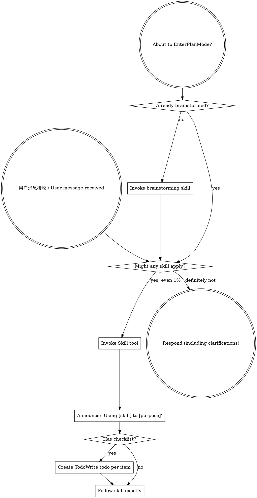

<SUBAGENT-STOP>
如果你是作为子代理被派发来执行特定任务，请跳过此 skill。
If you were dispatched as a subagent to execute a specific task, skip this skill.
</SUBAGENT-STOP>

<EXTREMELY-IMPORTANT>
如果你认为有哪怕 1% 的可能性某个 skill 适用于你正在做的事情，你必须绝对调用该 skill。
If you think there is even a 1% chance a skill might apply to what you are doing, you ABSOLUTELY MUST invoke the skill.

如果某个 skill 适用于你的任务，你别无选择，必须使用它。
IF A SKILL APPLIES TO YOUR TASK, YOU DO NOT HAVE A CHOICE. YOU MUST USE IT.

这是不可协商的。这不是可选的。你无法通过合理化来逃避这一点。
This is not negotiable. This is not optional. You cannot rationalize your way out of this.
</EXTREMELY-IMPORTANT>

## 指令优先级 / Instruction Priority

Superpowers skills 覆盖默认系统提示行为，但 **用户指令始终优先**：
Superpowers skills override default system prompt behavior, but **user instructions always take precedence**:

1. **用户的明确指令** (CLAUDE.md, GEMINI.md, AGENTS.md, 直接请求) — 最高优先级
   **User's explicit instructions** (CLAUDE.md, GEMINI.md, AGENTS.md, direct requests) — highest priority
2. **Superpowers skills** — 在冲突时覆盖默认系统行为
   **Superpowers skills** — override default system behavior where they conflict
3. **默认系统提示** — 最低优先级
   **Default system prompt** — lowest priority

如果 CLAUDE.md 说 "不要使用 TDD" 而 skill 说 "始终使用 TDD"，请遵循用户指令。用户是主导者。
If CLAUDE.md, GEMINI.md, or AGENTS.md says "don't use TDD" and a skill says "always use TDD," follow the user's instructions. The user is in control.

## 如何访问 Skills / How to Access Skills

**在 Trae IDE 中:** 使用 `Skill` 工具。当你调用 skill 时，其内容会被加载并呈现给你——直接遵循它。永远不要使用 Read 工具读取 skill 文件。
**In Trae IDE:** Use the `Skill` tool. When you invoke a skill, its content is loaded and presented to you—follow it directly. Never use the Read tool on skill files.

**调用示例 / Example:**
```json
{
  "name": "brainstorming"
}
```

## 平台适配 (Trae CN) / Platform Adaptation (Trae CN)

Trae CN 使用 Kimi 模型，支持以下工具：
Trae CN uses Kimi models and supports the following tools:

| Skill 引用 / Skill references | Trae 工具 / Trae Tool | 说明 / Description |
|-----------------|-----------|-------------|
| `Skill` tool | `Skill` | 通过名称调用 skill / Invoke a skill by name |
| `Read` | `Read` | 读取文件内容 / Read file contents |
| `Write` | `Write` | 写入/创建文件 / Write/create files |
| `Edit` (search/replace) | `SearchReplace` | 编辑文件 / Edit files |
| `DeleteFile` | `DeleteFile` | 删除文件 / Delete files |
| `TodoWrite` | `TodoWrite` | 任务跟踪 / Task tracking |
| `Grep` | `Grep` | 搜索文件内容 / Search file contents |
| `Glob` | `Glob` | 按模式查找文件 / Find files by pattern |
| `SearchCodebase` | `SearchCodebase` | 语义代码搜索 / Semantic code search |
| `Bash` (run commands) | `RunCommand` | 执行命令 / Execute commands |
| `WebSearch` | `WebSearch` | 网络搜索 / Web search |

### Trae 特有功能 / Trae-Specific Features

- **终端管理 / Terminal Management**: 最多 5 个终端，使用 `target_terminal` 参数指定 / Max 5 terminals, use `target_terminal` parameter
- **命令类型 / Command Types**: `web_server`, `long_running_process`, `short_running_process`, `other`
- **Shell 环境 / Shell Environment**: PowerShell (Windows) / Bash (Linux/Mac)
- **阻塞命令 / Blocking Commands**: 短命令设置 `blocking: true`，服务器设置 `blocking: false` / Set `blocking: true` for short commands, `blocking: false` for servers

# 使用 Skills / Using Skills

## 规则 / The Rule

**在做出任何响应或操作之前，先调用相关的 skill。** 即使只有 1% 的可能性某个 skill 适用，也应该调用它来检查。如果调用的 skill 最终不适合当前情况，则不需要使用它。
**Invoke relevant or requested skills BEFORE any response or action.** Even a 1% chance a skill might apply means that you should invoke the skill to check. If an invoked skill turns out to be wrong for the situation, you don't need to use it.



## 红旗警示 / Red Flags

以下想法意味着你应该 STOP —— 你在为自己找借口：
These thoughts mean STOP—you're rationalizing:

| 想法 / Thought | 现实 / Reality |
|---------|---------|
| "这只是个简单的问题" / "This is just a simple question" | 问题就是任务。检查 skills。/ Questions are tasks. Check for skills. |
| "我需要先获取更多上下文" / "I need more context first" | Skill 检查在澄清问题之前。/ Skill check comes BEFORE clarifying questions. |
| "让我先探索代码库" / "Let me explore the codebase first" | Skills 告诉你如何探索。先检查。/ Skills tell you HOW to explore. Check first. |
| "我可以快速查看 git/文件" / "I can check git/files quickly" | 文件缺少对话上下文。检查 skills。/ Files lack conversation context. Check for skills. |
| "让我先收集信息" / "Let me gather information first" | Skills 告诉你如何收集信息。/ Skills tell you HOW to gather information. |
| "这不需要正式的 skill" / "This doesn't need a formal skill" | 如果 skill 存在，使用它。/ If a skill exists, use it. |
| "我记得这个 skill" / "I remember this skill" | Skills 会演进。读取当前版本。/ Skills evolve. Read current version. |
| "这不算是任务" / "This doesn't count as a task" | 行动 = 任务。检查 skills。/ Action = task. Check for skills. |
| "这个 skill 太过了" / "The skill is overkill" | 简单的事会变复杂。使用它。/ Simple things become complex. Use it. |
| "我先做这一件事" / "I'll just do this one thing first" | 在做任何事之前先检查。/ Check BEFORE doing anything. |
| "这感觉很有成效" / "This feels productive" | 无纪律的行动浪费时间。Skills 防止这一点。/ Undisciplined action wastes time. Skills prevent this. |
| "我知道那是什么意思" / "I know what that means" | 知道概念 ≠ 使用 skill。调用它。/ Knowing the concept ≠ using the skill. Invoke it. |

## Skill 优先级 / Skill Priority

当多个 skills 可能适用时，按此顺序使用：
When multiple skills could apply, use this order:

1. **流程 skills 优先** (brainstorming, debugging) - 这些决定如何接近任务
   **Process skills first** (brainstorming, debugging) - these determine HOW to approach the task
2. **实现 skills 其次** (frontend-design, mcp-builder) - 这些指导执行
   **Implementation skills second** (frontend-design, mcp-builder) - these guide execution

"让我们构建 X" → 先 brainstorming，然后实现 skills。
"Let's build X" → brainstorming first, then implementation skills.

"修复这个 bug" → 先 debugging，然后领域特定的 skills。
"Fix this bug" → debugging first, then domain-specific skills.

## Skill 类型 / Skill Types

**严格型 / Rigid** (TDD, debugging): 严格遵循。不要偏离纪律。
Follow exactly. Don't adapt away discipline.

**灵活型 / Flexible** (patterns): 根据上下文调整原则。
Adapt principles to context.

Skill 本身会告诉你属于哪种类型。
The skill itself tells you which.

## 用户指令 / User Instructions

指令说明 WHAT（做什么），而不是 HOW（如何做）。"添加 X" 或 "修复 Y" 并不意味着跳过工作流程。
Instructions say WHAT, not HOW. "Add X" or "Fix Y" doesn't mean skip workflows.
